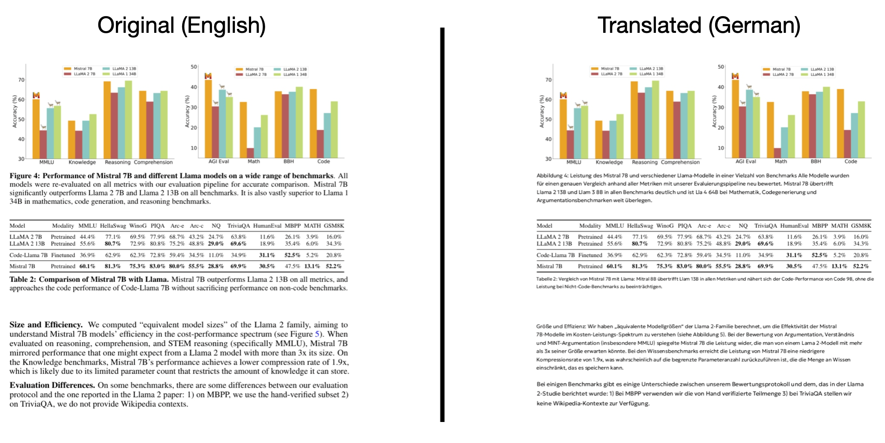

# Introduction

This is a simple script for offline PDF translation from English to Russian [ru], German [de], French [fr], Spanish [es], Italian [it], Portuguese [pr], Turkish [tr] languages.

We use public models to visually analyze the layout, discard formulas and images, and then translate the remaining text.




Resulted PDF will store combined images: original page and translated.

Personally, it helps me to read books with a little support in difficult moments :)

You can check 2 translated PDFs in the `test` folder.

# Installation

```bash
git clone https://github.com/rkorv/pdf_translator
cd pdf_translator

conda create -n pdf_translator python=3.10
conda activate pdf_translator

pip install -r requirements.txt
```

# Usage

```bash
python ./pdf_translator.py <path_to_pdf> <language_code> -o <output_pdf>
```

```bash
# Example
python ./pdf_translator.py input.pdf de -o output.pdf
```

This script will translate the input PDF file to the German language.
Use following language codes: `ru`, `de`, `fr`, `es`, `it`, `pr`, `tr`.

## Python API

```python
from pdf_translator import PDFTranslator

pdf_path = "input.pdf"

pdf_translator = PDFTranslator("es")

translations = pdf_translator.translate_pdf(pdf_path)
pdf_translator.save_to_pdf(pdf_path, translations, "output.pdf")
```


# References
- MADLAD400 [https://huggingface.co/google/madlad400-3b-mt]
- NLLB200 [https://huggingface.co/facebook/nllb-200-distilled-600M]
- Opus-MT [https://github.com/Helsinki-NLP/Opus-MT]
- Layout detection pre-trained model [https://github.com/LynnHaDo/Document-Layout-Analysis]

